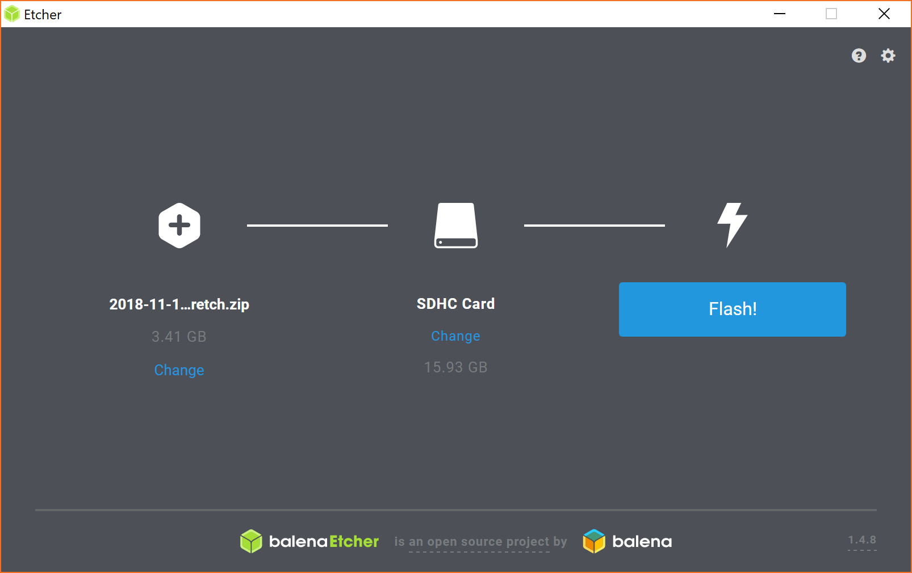
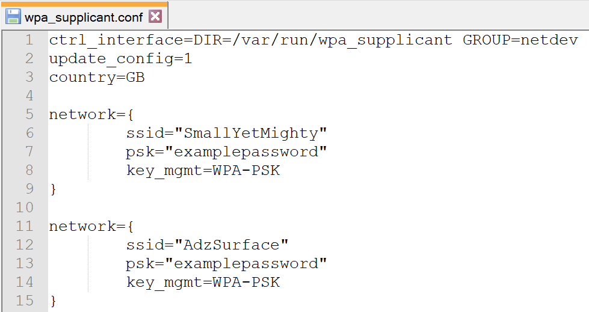
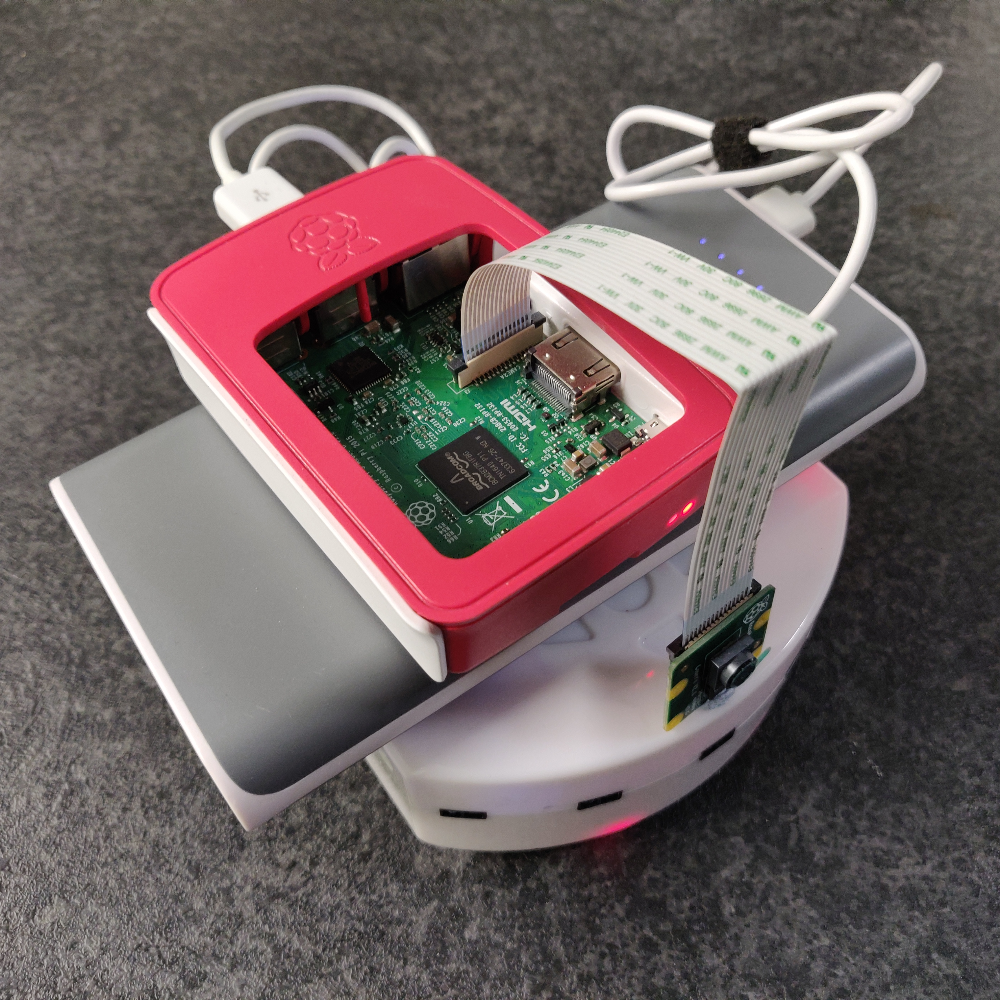
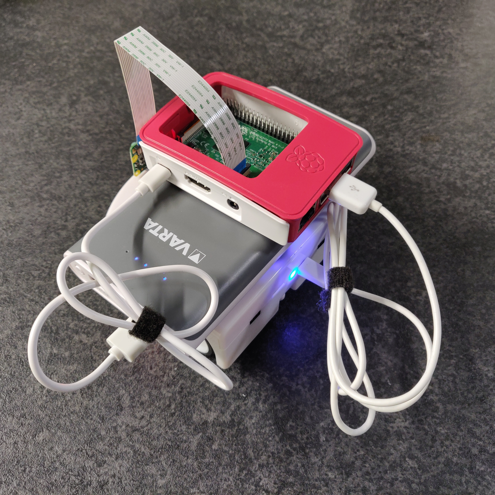
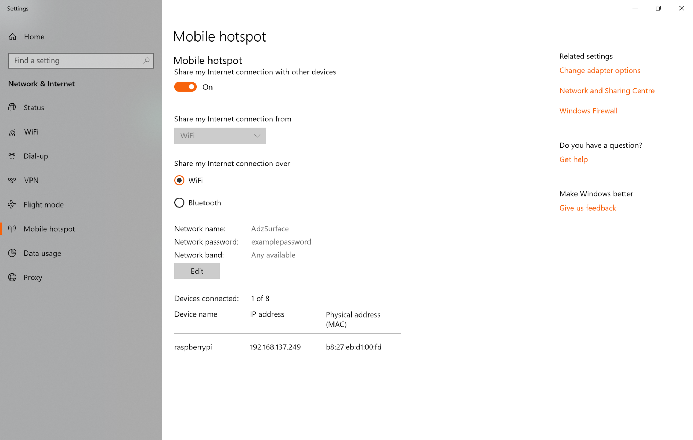
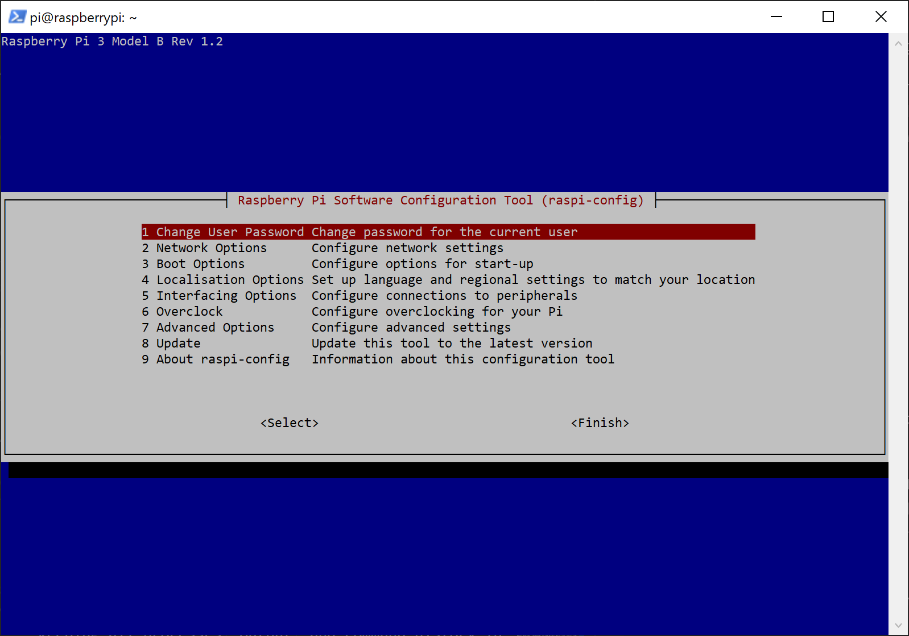
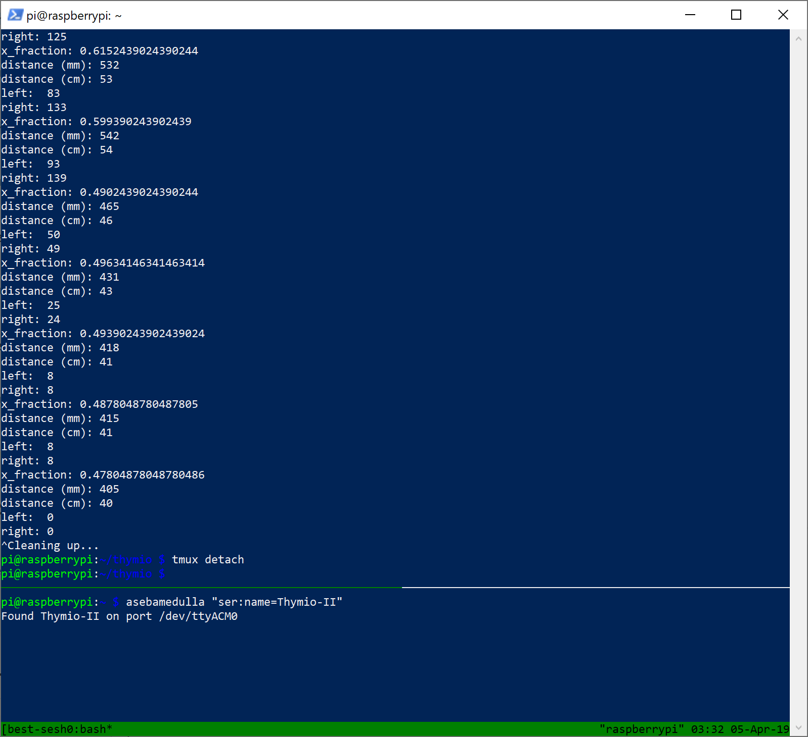

# Using a Raspberry Pi to Control a Thymio 2


## Introduction

The Thymio is a simple all in one robot that includes a variety of sensors.  For those who wish to develop more advanced behaviour, a more powerful processor may be required.  A good candidate for this is the Raspberry Pi, as it is small, cheap and can be powered by a battery so it may be attached to the Thymio, allowing it to move freely.

This tutorial shows how to make a clean Raspberry Pi installation, set up ready to read values from and control a Thymio robot.  It doesn’t require the Raspberry Pi to have a keyboard, mouse, or monitor connected at any point - it can be done completely headless.


## Requirements

Hardware

* Thymio 2
* Raspberry Pi (3rd gen for built in WiFi)
* Battery pack
* 2 USB Type A to Micro B USB Cables (one is required to support data transfer)
* A computer with an MicroSD / SD card reader.  Windows 10 allows a simple WiFi hotspot to be created which makes installation easier.
* [Optional] If you’d rather not use a hotspot, a router can be used.

Software

* Software to write the Raspberry Pi img to the MicroSD card such as BalenaEtcher (previously known as Etcher) [https://www.balena.io/etcher/](https://www.balena.io/etcher/)

Files

* Raspbian Stretch with Desktop.  This can be downloaded from [https://www.raspberrypi.org/downloads/raspbian/](https://www.raspberrypi.org/downloads/raspbian/).  The desktop version is required for DBUS to work, even if you don’t plan on using the desktop GUI.  Raspberry Pi recommended software is not required and discouraged if you have a smaller SD card because the storage space is required for compiling OpenCV.
* The setup files that can be downloaded from the [files-to-copy folder](files-to-copy) in this repository.
    * setup.sh
    * ssh
    * wpa_supplicant.conf

Good internet.  Some providers may block the Raspberry Pi from accessing the package repository.


## Installation

It should be noted that Windows is likely to throw up errors when reading the MicroSD card because the Raspberry Pi uses ext4, a filesystem Windows doesn’t know how to read.  These errors can be safely dismissed and the MicroSD card can be used as normal.


### Installing Raspbian

Insert the SD card into your computer and use BalenaEtcher (or your preferred software) to flash the Raspbian Stretch with Desktop zip file to the MicroSD card.  The software will first flash the OS, then validate it.



By default, BalenaEtcher ejects the MicroSD card when done but, we want to add some files to it before using it in the Raspberry Pi.  “Eject on success” can be disabled in the settings before flashing, or the MicroSD card can be removed and reinserted after the OS has been successfully flashed.

While the OS is flashing, run through the next step “WiFi for the Raspberry Pi”


### WiFi for the Raspberry Pi

It is recommended to use WiFi you control.  By this I mean WiFi where you can see the IPs of connected devices and it won't be blocked by your ISP.  The easiest solution is to use the Windows 10 hotspot feature but, if you have access to your own router that allows you to see connected devices, that will also work (and will probably be more reliable).  Restrictions on the internet can cause downloads to fail or the Raspberry Pi package manager to be blocked.  This guide will show how to complete this step using the Windows 10 hotspot feature.

Note: if this hotspot feature doesn't work or if you're not on Windows, all you need is to be able to get the IP od the Raspberry Pi so it can be accessed headless via SSH.  You could alternatively, get the IP of the Raspberry Pi from a router or just connect all the required peripherals to access the Raspberry pi directly.  This will become very cumbersome once the Thymio-II starts moving around though!

Search for "hotspot" in the Windows search and select “Change mobile hotspot settings”.  This will open the settings where you can setup your own WiFi hotspot name and password.  You can also get there by opening Settings -> Network and Internet -> Mobile hotspot.  Turn the hotspot on ready for the Raspberry Pi to connect.


### Adding Setup Files

Download the setup files from the [files-to-copy folder](files-to-copy) in this repository.  Modify the wpa_supplicant.conf file to add your own WiFi details as set in the previous step.  Multiple networks can be added if, for example, you have multiple PCs or routers you’ll want to use at different times to work on the Raspberry Pi.



After the wpa_supplicant.conf file has been modified, copy all of the files onto the MicroSD card, which should just be called “boot”.

If you have any scripts you want to run, you can copy them over now or you can send them over later using the `scp` (secure copy) command.  Alternatively, you can write them on the Raspberry Pi once it's up and running.


### Setup Raspberry Pi and Thymio

Now the MicroSD card is set up, insert it into the Raspberry Pi and start plugging everything together.  Blu-tack can be used to secure the Thymio, battery, and Raspberry Pi together so they don’t slide off when moving.

* Place the battery on the Thymio and the Raspberry Pi on the battery
* Plug the (rear of the) Thymio into one of the Raspberry Pi’s USB-A ports (this should be the data cable)
* Plug the Raspberry Pi (micro-B USB) into the battery pack (USB-A) to power it on

<p float="left">
   
   
</p>


### Connecting to the Raspberry Pi

It’s time to connect to the Raspberry Pi via SSH.  Putty, Git Bash, and others can be used to connect but, Windows Powershell will be used here because it comes preinstalled on Windows 10 with SSH.

Assuming you used a Windows 10 hotspot, go back to the settings page where you will be able to see the IP of the now connected Raspberry Pi.




You can now simply view the IP address of the Raspberry Pi connected to your hotspot and SSH straight in without needing to access the Raspberry Pi directly.  Run the below command in Powershell, replacing the example IP with the one you just found.

```
ssh pi@192.168.137.249
```

If asked whether to trust the device’s fingerprint or not, do so.

When prompted for the password, use the password “raspberry”.  Because this is a clean installation, the default password is used and upon logging in to the Raspberry Pi, you will be prompted to change the password using “passwd”.  It’s recommended you do this.

You will also need to enable the Raspberry Pi camera.  this can be done by entering:

```
sudo raspi-config
```

You should see a screen like this:



Now navigate the menu using the arrow keys.  Go to "5 Interfacing Options", then "P1 Camera" and when asked if you would like it to be enabled, select "Yes".

### Installing and Using tmux

The setup script takes a long time to run (roughly an hour and a half) and if the SSH connection drops everything printed to terminal and things running in the background will be gone.  Enter tmux!

tmux creates sessions that be left and returned two, keeping all processes, output, and command history in tact.  If the connection dies, you can simply reconnect to the Raspberry Pi and then reattach to the session as if nothing happened.

Install tmux by using the following command

```
sudo apt install tmux
```

A cheat sheet of tmux commands can be found [here](https://gist.github.com/henrik/1967800) and all commands and parameters can of course be found in the manual by typing `man tmux`.  I'll list out the key ones here (and a few later on).

Sign in to Raspberry Pi for the first time since it booted, create a new session.

```
tmux new -s your-session-name
```

Want to go elsewhere and leave the session running?

```
tmux detach
```

Want to return to your session after leaving or losing connection?

```
tmux attach -t your-session-name
```

Ah, but I forgot what my session was called!  List them.

```
tmux ls
```

That should do for now.


### Running the Setup Script

Run the setup script by using the command

```
bash /boot/setup.sh
```

If the code you want to run (such as a Python script) was also added to the boot section, run the following commands to move it to the thymio folder and make it runnable, replacing “example.py” with your own file name

```
sudo mv /boot/example.py thymio/
sudo chown pi thymio/example.py
```


### Connecting to the Thymio and Running

Run the Aseba Medulla service to connect to the Thymio-II so it can be controlled via the DBUS.  This service should be left running in order for your code to work.  The `&` symbol tells it to run in a background process so we can run other scripts in terminal while the service keeps runnning.

Warning: When connecting to the Thymio-II, the Thymio-II will turn on and go into its default behaviour of driving forwards.  You will need to click the central button on top to stop it moving.

```
asebamedulla "ser:name=Thymio-II" &
```

Alternatively, you can split the tmux session and gain another terminal in parallel with the first that you can use to run the Aseba service.  Enter the tmux command mode by pressing `Ctrl + B`.  Now you can split the terminal into two panes by pressing `"`.  Your bottom pane doesn't need to be so big just for running the Aseba service though, so we can resize by entering command mode `Ctrl + B` then typing `resize-pane -D 15`.  The `-D` means down and 15 specifies the number of lines.

To switch between panes, enter command mode `Ctrl + B` then using the arrow keys to move up or down.

In the bottom, run the Aseba Medulla service.  We don't need the `&` to make it run in the background because it has its own pane now.

```
asebamedulla "ser:name=Thymio-II"
```



Finally, run your Python code to control the Thymio!

```
python3 ~/thymio/example.py
```

*Wait a minute, I don't have a Python script on there yet!*

If you didn't copy scripts over durig the install, it's not too late.  You can use `scp` (secure copy) to copy files from your computer to the Raspberry Pi.  Open a new terminal on your computer (powershell if on Windows) and use the following command, replacing the IP and file paths as needed.

```
scp S:\path\to\script.py pi@192.168.137.249:~/thymio/
```


## Explanation of Setup Script

The setup script is very well commented, explaining what all of the commands are for.

Originally, the explanation was here as part of the tutorial however, it was moved into the setup script for two reasons:

1. Having the explanation in the tutorial caused the tutorial to become large and cluttered
2. Having the comments in the script reduces the chances of the documentation falling out of sync with the code


## Demo Python Script

The [demo Python script](example-scripts/follow-qr-code.py) has the robot maintain a set distance from a QR code it can see.  It will also turn to face the QR code, so the robot can be led around.

If you're trying this, the content of the QR code doesn't matter but, for the distance to be correct, you must specify the height of the QR code in the variable `qr_real_height_mm`.

The demo script has the following functionality

1. Connect to the Thymio-II
2. Use the camera as a video stream
3. Detect QR codes in the video stream
4. Calculate the distance to the QR code
5. Calculate the horizontal position of the QR code
6. Command motors to turn and drive towards (or from) the QR code, changing speed depending on distance

When reading the script, you should look at it in this order:

1. The imports - see what's being used
2. The main method, specified near the bottom `if __name__ == '__main__':`
3. The `drive_towards_qr()` method

The API for the Thymio-II can be found [here](https://aseba.readthedocs.io/en/latest/thymio-api.html).

EDIT:  the documentation has been removed but, can still be viewed (with no styling) via the wayback machine [here](https://web.archive.org/web/20180716170641/http://aseba.readthedocs.io/en/latest/thymio-api.html).
